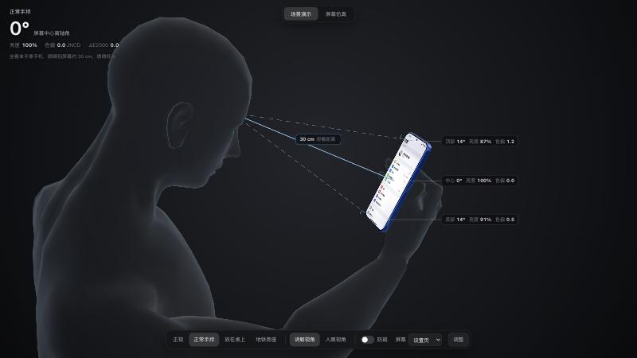

# 手机屏幕可视角度仿真

根据实测的屏幕离轴光谱数据，在浏览器里用 WebGL 仿真手机屏幕从不同角度看过去的亮度衰减与色偏，并可对比防窥模式 / 防窥膜的效果。

**在线访问：<https://smartlanny.github.io/phone-view-angle-sim/>**



## 两种模式

- **场景演示**（默认）：三维场景里一个人拿着手机——正视、正常手持、放在桌上、地铁旁座（旁边乘客斜看，可开关防窥对比）。可在“讲解视角”和“人眼视角”之间平滑切换；屏幕永远按人物眼睛的位置、用实测数据着色，讲解视角里标出眼睛到屏幕顶 / 中 / 底的视线、离轴角、亮度和色偏。源码在 `scene3d/`，说明见 [scene3d/README.md](scene3d/README.md)。
- **屏幕仿真**：下面列出的原有工具。

## 功能（屏幕仿真）

- **仿真效果**：拖动旋转手机，按每个像素相对眼睛的实际离轴角逐像素计算亮度与色偏（近距离观看时屏幕上下两端角度不同，也会体现出来）
- **观看方向盘**：极坐标热力图显示各方向的亮度 / 色偏，可直接在盘上拖动设置观看方向；多种热力图配色；无实测的方位用斜线标出（上下镜像补全）
- **随离轴角变化曲线**：相对亮度、色偏 JNCD 随离轴角的变化，0° / 30° / 45° / 60° / 70° 快速切换，可自动扫描
- **读数**：离轴角、亮度、色偏 JNCD、ΔE2000（含亮度）
- **双机对比**：左右并排对比两台机器 / 防窥开关前后
- **双眼立体**：按瞳距分别渲染左右眼所见画面，可平行视或交叉视观看双眼看到的差异
- **屏幕内容**：浅色 / 深色设置页、阅读、纯白、三原色、色卡、灰阶，也可上传或直接拖入、粘贴自己的图片
- **显示方式**：仿真效果 / 原图 / 离轴角分布，竖屏 / 横屏，多种机身配色
- 当前视角会写进网址，复制链接即可分享同一个视角

## 内置测试数据

| 机型 | 状态 |
|---|---|
| 小米 18 Pro Max | 普通 / 开启防窥模式 |
| iPhone 18 Pro Max（GH3 屏） | 普通 / 贴防窥膜 |

每种状态测量 4 个方向：手机竖着转（0°）、面内顺时针转 30°、60°、横着转（90°），每个方向离轴角 −70° ~ 70°、步长 2°，记录白 / 红 / 绿 / 蓝 / 黑五个画面的 CIE XYZ（cd/m²）。其它方向由这 8 条半径线插值得到。

数据已经打包进 `web/data.js`，网页打开即用，无需后端。原始测量文件（`.ang2`）也一并放在仓库里。

## 本地运行

纯静态网页，任意静态服务器即可：

```bash
python3 -m http.server 8765 --directory web
```

然后打开 <http://localhost:8765>。

## 更新数据

把新的 `.ang2` 测量文件放进仓库目录（可以放在以机型名开头的子文件夹里，多出的部分会作为屏幕供应商后缀，如 `iphone18 Pro Max GH3/`），然后重新生成 `web/data.js`：

```bash
python3 tools/convert_ang2.py
```

机型外观参数（尺寸、圆角、开孔、配色）在 `web/devices.js` 中配置。

## 目录结构

```
web/                网页本体（GitHub Pages 发布这个目录）
  scene3d.js        场景演示模式（由 scene3d/ 构建，npm run build:web）
  scene3d-person.js 内嵌的人物模型（CC0）
  index.html
  app.js            界面与交互
  model.js          可视角光学模型（插值、色偏、JNCD、ΔE2000）
  phone3d.js        手机机身几何与渲染
  devices.js        机型外观参数
  patterns.js       程序化测试画面
  viz.js            观看方向盘与随离轴角变化曲线
  data.js           内置测量数据（由 tools/convert_ang2.py 生成）
tools/
  convert_ang2.py   .ang2 → web/data.js
  embed_avatar.py   头像内嵌为 web/avatar.js
scene3d/            场景演示的源码（Vite + TypeScript + three.js）
docs/               文献调研笔记
*.ang2              原始测量数据
```

## 许可

[MIT](LICENSE)
